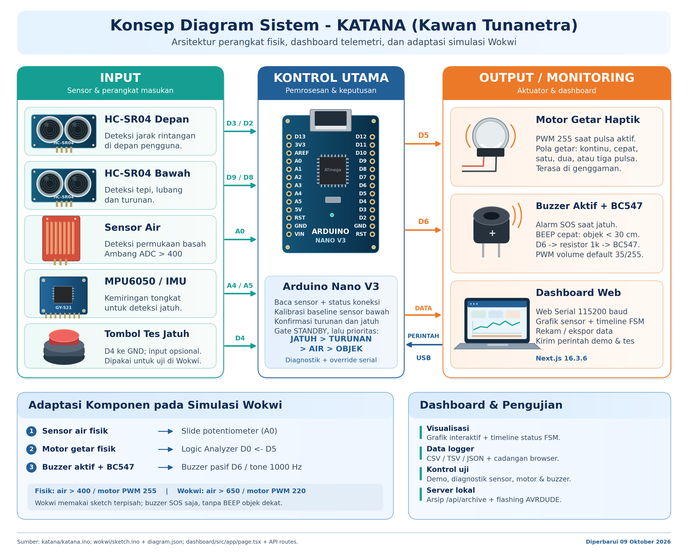
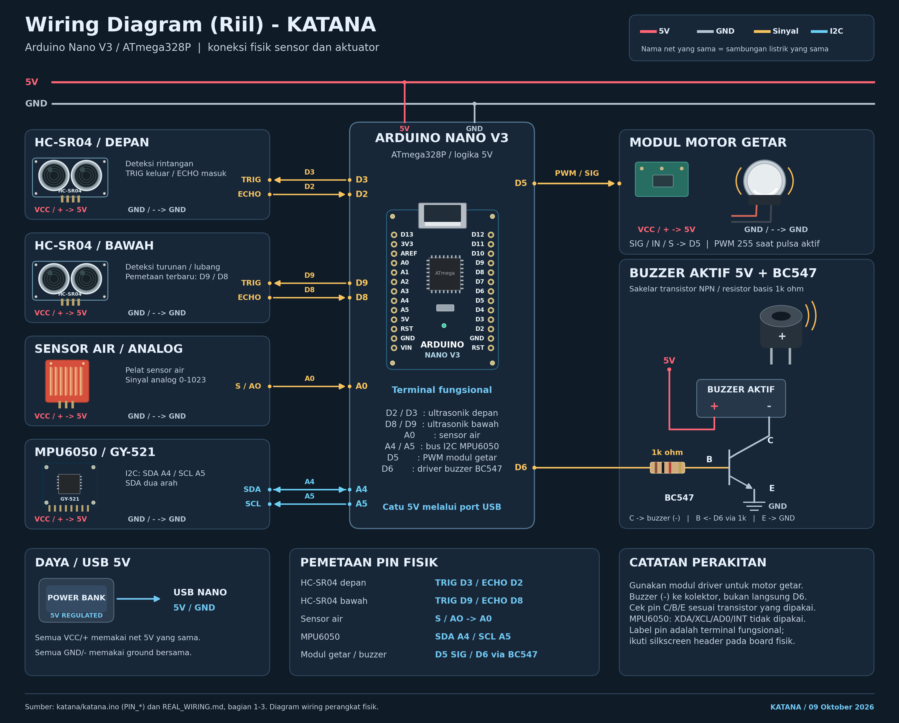
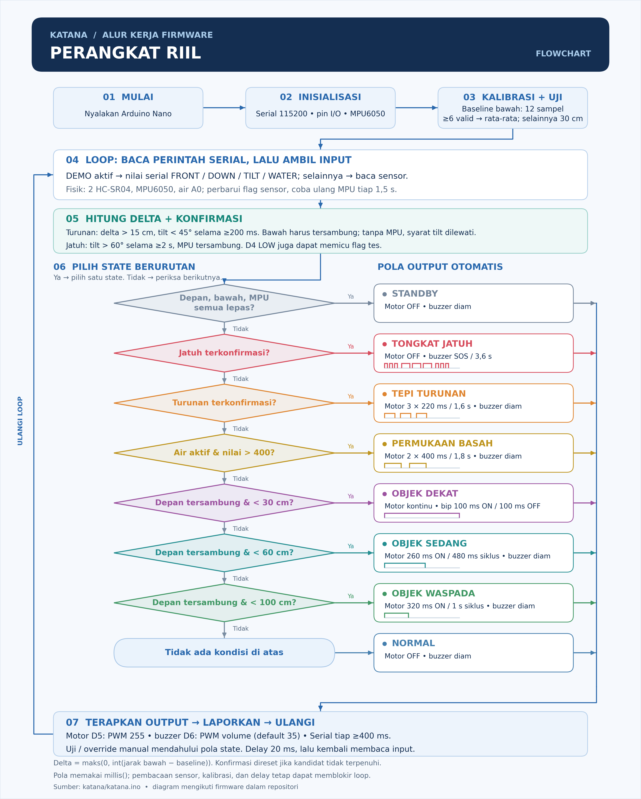
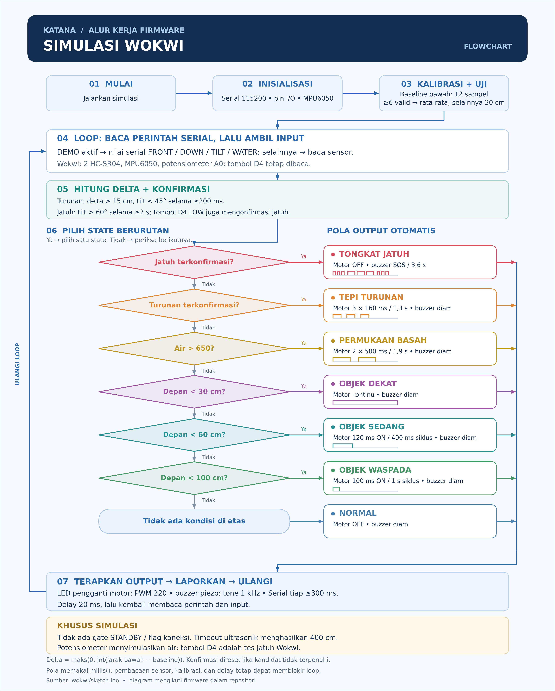

<p align="center">
  
</p>

# KATANA (Kawan Tunanetra / Smart Cane Assistant)

> **Intelligent Navigation & Safety Cane for the Visually Impaired**  
> A retrofit smart cane prototype built on an ergonomic forearm crutch, integrating multi-sensor environmental perception: frontal obstacle clearance, ground drop-off and pothole detection, puddle/water hazard sensing, high-power tactile haptic feedback, and an emergency SOS acoustic beacon triggered upon falls.

Online Virtual Simulation: [Wokwi KATANA Simulation](https://wokwi.com/projects/474342215789115393)

---

## System Overview & Architecture

KATANA retrofits an ergonomic forearm crutch into an assistive navigation device designed for outdoor and indoor mobility. It processes sensor streams in real time on an onboard microcontroller, evaluates hazard states via a deterministic priority engine, and provides distinct haptic vibration and acoustic alerts to the user.

```text
[ ENVIRONMENTAL INPUTS ]               [ PROCESSING UNIT ]              [ FEEDBACK ACTUATORS ]

HC-SR04 (Front Obstacle)   ---(D2/D3)--->                     ---(PWM D5)---> Eccentric Haptic Motor
HC-SR04 (Ground Drop-off)  ---(D8/D9)----> Arduino Nano V3                    (Handle Vibration - PWM 255)
Water Sensor (Conductive)  ---(A0)------> (ATmega328P / 16MHz)
MPU6050 (6-Axis IMU)       ---(I2C)----->                     ---(D6+BC547)-> 85dB Active Buzzer
                                                                              (SOS Morse & Collision Beep)
                                                  |
                                                  v
                                          USB Serial (115200)
                                                  |
                                                  v
                                       [ TELEMETRY DASHBOARD ]
                                       Next.js + Web Serial API
                                       Live Visualizer & CSV Logger
```

---

## Visual Documentation

### Mechanical Blueprint & Physical Dimensions


> 2D CAD dimensional drawing of the KATANA smart cane assembly. Shows the structural layout of the forearm crutch chassis, sensor mounting positions (front-facing HC-SR04, downward-facing HC-SR04, MPU6050 IMU, and water sensor plate), handle ergonomics, and cable routing channels.

---

### System Architecture Concept Diagram (v2)



> High-level block diagram illustrating the full signal flow: environmental sensor inputs, onboard ATmega328P processing unit, hazard priority state machine, feedback actuator outputs, and the USB serial telemetry uplink to the Next.js dashboard.

---

### Physical Electronic Wiring Schematic (v2)



> Complete breadboard-level wiring schematic for the production physical hardware build. Includes pin assignments for all sensors (D2/D3 front ultrasonic, D8/D9 downward ultrasonic, A0 water sensor, I2C SDA/SCL for MPU6050), actuator driver circuits (PWM D5 motor at full 255 duty cycle, BC547 NPN transistor switch D6 for buzzer), and power distribution rails.

---

### Embedded Firmware Flowchart - Physical Hardware (v2)



> State machine flowchart of the production firmware running on the physical Arduino Nano. Covers the `setup()` initialization sequence (sensor health checks, IMU auto-address scan & bus recovery), the main `loop()` polling cycle, the deterministic hazard priority ladder evaluation, and serial override command parsing.

---

### Embedded Firmware Flowchart - Wokwi Virtual Simulation (v2)



> Adapted flowchart for the Wokwi virtual simulation runtime. Highlights the differences from the physical build: simulated sensor reads, virtual actuator outputs, and the `WOKWI_SIMULATION` compile flag branch paths.

---

## Repository Structure

```text
katana/
|-- assets/                   # Architectural blueprints, schematics, and flowcharts (v2)
|   |-- blueprint.png         # Mechanical blueprint and 2D CAD dimensions
|   |-- konsep_diagram_v2.png # System architecture concept diagram (v2)
|   |-- wiring_diagram_riil_v2.png # Physical electronic schematic & pin mapping (v2)
|   |-- flowchart_riil_v2.png # Production hardware embedded firmware flowchart (v2)
|   |-- flowchart_simulasi_v2.png # Virtual Wokwi simulation runtime flowchart (v2)
|   `-- katana_logo.png       # Official project emblem and logo
|-- archive/                  # Recorded telemetry datasets & auto-archived CSV test logs
|-- dashboard/                # Web Serial Live Telemetry Dashboard (Next.js 15, Tailwind CSS, Lucide)
|   |-- src/app/page.tsx      # Main telemetry interface & interactive simulation controls
|   |-- src/app/visualizer/   # Data Visualizer tab (SVG cursor tracking & FSM state ribbons)
|   |-- src/app/api/          # Telemetry auto-archive API endpoint (/api/telemetry-archive)
|   `-- package.json          # Frontend dependencies and runtime scripts
|-- diagnostic/               # Standalone hardware diagnostic test suite
|   `-- diagnostic.ino        # Verification sketch for I2C, ultrasonics, water sensor, and actuators
|-- katana/                   # Production embedded firmware
|   `-- katana.ino            # Main sketch running on physical Arduino Nano hardware
|-- tools/                    # Hardware debugging and calibration tools
|   |-- pin_diagnostics/      # Pin inversion and continuity testing utilities
|   |-- single_sensor_test/   # Isolated sensor unit tests
|   `-- three_stage_diagnostic/ # Progressive validation test suite
|-- wokwi/                    # Virtual simulation bundle
|   |-- sketch.ino            # Simulation sketch configured for virtual runtime
|   |-- diagram.json          # Virtual breadboard and wiring definition
|   `-- wokwi.toml            # Emulator configuration
|-- PANDUAN_TESTING.md        # Comprehensive real-world scenario testing manual (Cases 1-8)
|-- REAL_WIRING.md            # Physical pinout guide, transistor driver schematic, and assembly checklist
|-- README.md                 # Core project documentation and operation manual (English)
|-- AGENTS.md                 # Strict code standards, commit conventions, and no-emoji policies
`-- .gitignore                # Build artifact exclusions
```

---

## Hazard Evaluation & Alert Priority Logic

When multiple hazard conditions are detected simultaneously, the internal finite state machine (FSM) selects a single active state based on a strict priority ladder. This eliminates cognitive overload and tactile confusion for the user:

| Priority | Hazard Scenario | Sensor Trigger | Active State Name | Feedback Actuator Response |
|:---:|---|---|---|---|
| **1 (Highest)** | **Cane Dropped / Fallen User** | MPU6050: Tilt angle > 60 deg (or simulated > 30 deg) sustained for > 2.0s | `TONGKAT_JATUH` | Vibration motor stops; Buzzer sounds continuous acoustic Morse SOS pattern (`... --- ...`) |
| **2** | **Drop-off / Pothole / Downward Stairs** | HC-SR04 Down: Ground distance exceeds > 45 cm (normal floor surface ~25-38 cm) | `TEPI_TURUNAN` | 3 distinct high-intensity haptic pulses ("3 3 3") at 100% full power (PWM 255); Buzzer silent |
| **3** | **Water Puddle / Flooded Surface** | Conductive Water Sensor Plate: Analog signal (A0) > 400 (calibrated wet threshold) | `PERMUKAAN_BASAH` | 2 sustained long haptic pulses ("2 2 2") at 100% full power (PWM 255); Buzzer silent |
| **4** | **Frontal Obstacle (Critical Near)** | HC-SR04 Front: Distance < 30 cm | `OBJEK_DEKAT` | Continuous haptic vibration (100% PWM 255 nonstop) + Fast staccato acoustic BEEP (100ms ON / 100ms OFF) |
| **5** | **Frontal Obstacle (Medium Distance)** | HC-SR04 Front: Distance between 30 cm and 60 cm | `OBJEK_SEDANG` | Rapid pulsing haptic vibration (480ms cycle: 260ms ON / 220ms OFF) at 100% PWM 255; Buzzer silent |
| **6** | **Frontal Obstacle (Far Warning)** | HC-SR04 Front: Distance between 60 cm and 100 cm | `OBJEK_WASPADA` | Single periodic haptic tap per second ("tek 1 1", 1000ms cycle: 320ms ON / 680ms OFF) at PWM 255; Buzzer silent |
| **-** | **Sensor Disconnected / Cable Fault** | Echo timeout (> 25ms) or missing I2C ACK response | `STANDBY` | Motor idle, buzzer idle, anti-false alarm protection active; Telemetry flags sensor as `LEPAS` |
| **-** | **Normal Walking Path** | All sensors within safe clearance thresholds | `NORMAL` | Motor idle, buzzer idle |

---

## Tactile Haptic System Architecture

To ensure physical vibration alerts are felt unambiguously through thick walking grips and in the palm of the user's hand:
1. **Full Voltage Drive (PWM 255)**: All active pulses drive the eccentric rotating mass (ERM) motor at 100% duty cycle, ensuring rapid rotor acceleration and maximum mechanical impact.
2. **Cadence & Rhythm Differentiation**: Differentiation is achieved strictly through distinct pulse counts and pause intervals rather than varying motor speed:
   - **Critical Obstacle (< 30 cm)**: Continuous nonstop vibration without pauses.
   - **Medium Obstacle (30 - 60 cm)**: Rapid rhythmic pulse stream ("tek... tek... tek...").
   - **Far Obstacle (60 - 100 cm)**: Single solid tap every 1 second ("tek 1 1").
   - **Drop-off Hazard**: Triple rhythmic burst ("3 3 3") with a 700ms recovery window.
   - **Puddle Hazard**: Double long pulse ("2 2 2") with an 800ms recovery window.

---

## Operating Instructions

### 1. Flashing Physical Hardware (Arduino Nano V3)

1. Open [katana/katana.ino](katana/katana.ino) in the Arduino IDE.
2. Verify the configuration flag is set for physical deployment:
   ```cpp
   #define WOKWI_SIMULATION 0
   ```
3. Connect your Arduino Nano via USB.
4. Select board **Arduino Nano** and choose your serial port (e.g., `/dev/cu.usbserial-110` on macOS or `COM3` on Windows).
5. For CH340 USB clones, select **Tools > Processor > ATmega328P (Old Bootloader)**.
6. Click **Upload**.
7. Open **Serial Monitor** at **115200 baud** to view real-time diagnostics.

> **Direct Ground Surface Distance (On-Point Detection)**  
> The downward-facing ultrasonic sensor directly measures the absolute distance to the floor surface. When walking over normal flat terrain, the distance stays between 25–38 cm. When reaching a drop-off, staircase, or pothole (> 45 cm), the system immediately confirms a hazard without relying on startup baseline calibration.

---

### 2. Running the Live Telemetry Dashboard (Next.js)

1. Navigate to the `dashboard/` directory and install dependencies:
   ```bash
   cd dashboard
   npm install
   ```
2. Start the local development server:
   ```bash
   npm run dev
   ```
3. Open a Chromium-based browser (**Google Chrome**, **Brave**, or **Microsoft Edge**) at [http://localhost:3000](http://localhost:3000).
4. Click **Hubungkan Arduino** and select the corresponding USB serial port.
5. Key Dashboard Features:
   - **Live Telemetry Overview**: Real-time obstacle radar clearance, direct ground surface distance, surface moisture conductivity (`KERING` vs `BASAH`), and actuator indicators.
   - **Data Visualizer Tab**: Multi-stream interactive line graphs with SVG pixel-perfect cursor tracking, crosshairs, pan/zoom, and FSM state transition timeline ribbons.
   - **Telemetry Data Logger & Auto-Archive**: Record sensor streams with sample indexing, relative elapsed time, hazard codes, and binary actuator flags; automatically save sessions to `archive/` via `/api/telemetry-archive`, export CSV, or copy TSV to clipboard for instant pasting into spreadsheet software.
   - **Sensor Integrity Badges**: Identifies active physical sensors (`RIIL`) versus disconnected cables (`LEPAS`).

*(Note: Close the Arduino IDE Serial Monitor before connecting through the browser to avoid serial port contention).*

---

### 3. Interactive Serial Test & Simulation Protocol

The KATANA firmware includes an extensive bidirectional serial command parser. Developers can test every hazard condition, haptic cadence, and acoustic pattern without moving the physical cane:

| Perintah Serial | Target Pengujian | Respon Sistem yang Diharapkan |
|---|---|---|
| `FALL` | Simulasi Tongkat Jatuh | Kemiringan 75 deg, Buzzer alarm SOS Morse aktif, Motor mati |
| `DROP` | Simulasi Tepi Turunan | Delta bawah +25 cm, Motor 3 denyut ("3 3 3") PWM 255 |
| `WET` | Simulasi Genangan Air | Nilai air 850, Motor 2 denyut panjang ("2 2 2") PWM 255 |
| `NEAR` | Simulasi Rintangan Dekat | Jarak depan 15 cm, Motor bergetar panjer kontinu PWM 255, Buzzer BEEP aktif |
| `FRONT <cm>` | Override Jarak Depan | Mengatur jarak depan secara presisi (contoh: `FRONT 45`) |
| `DOWN <cm>` | Override Jarak Bawah | Mengatur jarak permukaan lantai (contoh: `DOWN 55`) |
| `TILT <deg>` | Override Sudut Kemiringan | Mengatur sudut kemiringan (contoh: `TILT 72`) |
| `WATER <val>` | Override Nilai Air | Mengatur nilai ADC sensor air (contoh: `WATER 850`) |
| `NORMAL` | Reset ke Kondisi Normal | Mengembalikan status ke nominal, mematikan seluruh alarm |
| `DIAG` / `CHECK` | Uji Koneksi Pin & Sensor | Mencetak laporan diagnosa hardware ke-4 sensor secara mendalam |
| `TEST VIBE 3` | Uji Haptik Turunan/Lubang | Pola denyut 3-3-3 tenaga penuh (PWM 255) selama 4.8 detik |
| `TEST VIBE 2` | Uji Haptik Genangan Air | Pola denyut ganda 2-2-2 tenaga penuh (PWM 255) selama 5.4 detik |
| `TEST VIBE 1` | Uji Haptik Jarak Jauh | Pola tunggal tek 1-1 tenaga penuh (PWM 255) selama 4.0 detik |
| `TEST VIBE MED` | Uji Haptik Jarak Sedang | Pola denyut cepat rapat (PWM 255) selama 4.0 detik |
| `TEST VIBE NEAR` | Uji Haptik Jarak Dekat | Pola getar panjer kontinu penuh (PWM 255) selama 3.0 detik |
| `TEST MOTOR` | Hardware Aktuator Motor | Motor D5 aktif tenaga penuh (PWM 255) selama 2.0 detik |
| `TEST BUZZER` | Hardware Aktuator Buzzer | Buzzer D6 berbunyi beep selama 1.5 detik |
| `TEST OUTPUT` | Self-Test Seluruh Aktuator | Siklus pengujian motor diikuti bunyi alarm buzzer |
| `STOP` | Reset Aktuator Manual | Mematikan paksa seluruh getaran motor dan suara buzzer |
| `WATER ON / OFF` | Kontrol Sensor Air Fisik | Mengaktifkan / menonaktifkan pembacaan ADC pin A0 |
| `DEMO OFF` | Keluar Mode Simulasi | Kembali membaca sensor hardware fisik |

---

### 4. Running Wokwi Virtual Simulation

- **Browser Edition:** Open [https://wokwi.com/projects/474342215789115393](https://wokwi.com/projects/474342215789115393).
- **Local VS Code Edition:** Open the `wokwi/` folder with the Wokwi for VS Code extension installed and launch `wokwi.toml`.

---

## Technical Specifications

| Parameter | Specification |
|---|---|
| **Core Microcontroller** | ATmega328P (8-bit AVR, 16 MHz, 32KB Flash, 2KB SRAM) |
| **Supply Voltage** | 5V DC via USB / 5V 2A portable battery bank |
| **Front Obstacle Range** | 2 cm - 100 cm effective detection window (40 kHz ultrasonic) with auto pin-inversion detection |
| **Drop-off Threshold** | Delta > 15 cm above ground baseline (12-sample startup calibration) |
| **Moisture Sensitivity** | Conductive FR-4 grid; calibrated threshold ADC > 400 (active by default) |
| **Tilt & Inertial Sensing** | 6-Axis MPU6050 with dynamic I2C address detection (0x68/0x69) and I2C bus recovery pulse |
| **Haptic Actuator** | Coreless vibration motor driven at full power PWM 255 (D5) with distinct rhythmic intervals |
| **Acoustic Actuator** | 5V Active Buzzer driven via BC547 NPN transistor switch (D6) with Morse SOS & collision beep |
| **Communication** | UART Serial at 115200 Baud, Web Serial API compliant, CSV logging with auto-archive API |

---

## Documentation Links

| Document | Description |
|---|---|
| [PANDUAN_TESTING.md](PANDUAN_TESTING.md) | Comprehensive real-world scenario testing manual (Cases 1-8), validation checklist, and simulation guide |
| [REAL_WIRING.md](REAL_WIRING.md) | Step-by-step breadboard assembly, transistor driver schematic, and pin mapping checklist |
| [Telemetry Dashboard Guide](dashboard/README.md) | Dashboard architecture, Web Serial setup, Data Visualizer, and component reference |
| [Hardware Diagnostic Sketch](diagnostic/diagnostic.ino) | Standalone hardware diagnostic test suite for validating all sensors and actuators |
| [Wokwi Simulation](https://wokwi.com/projects/474342215789115393) | Live virtual simulation in the browser, no hardware required |
